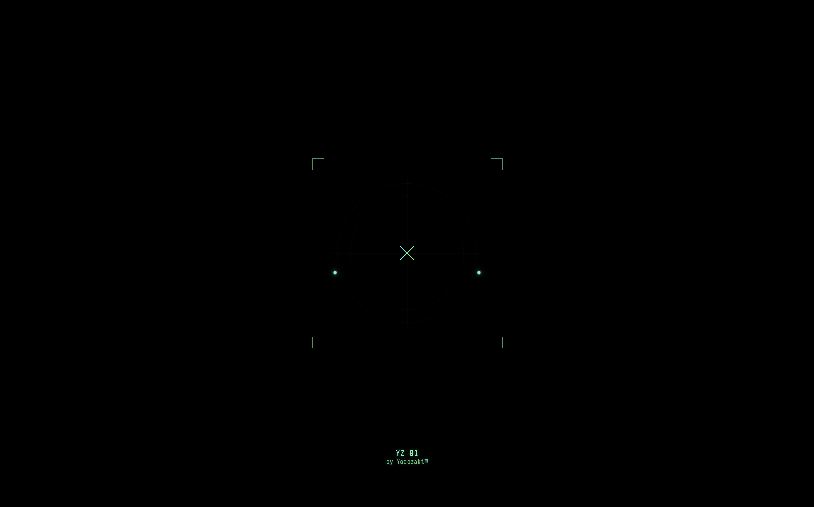
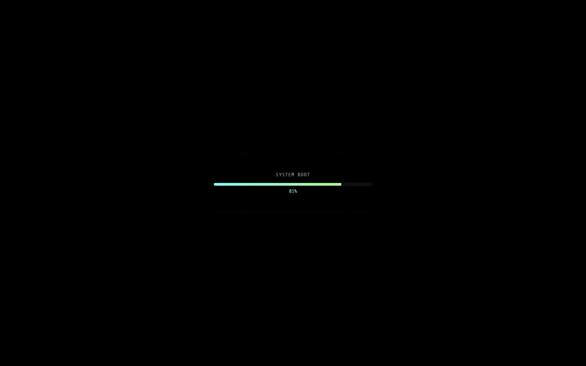
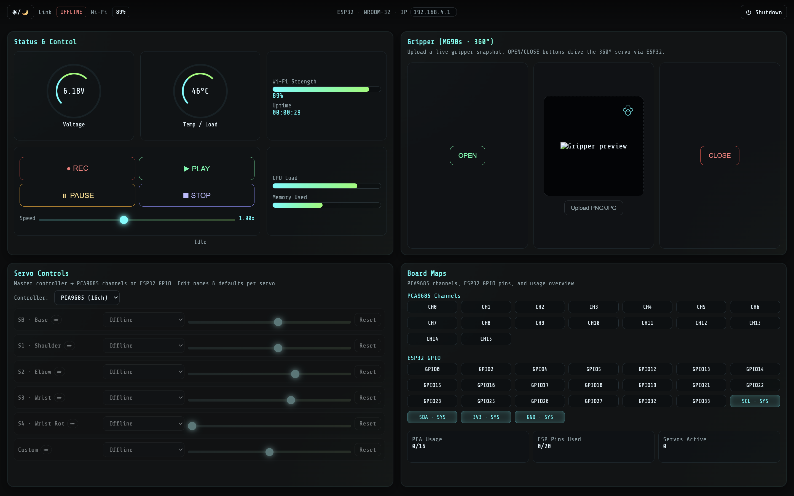

  

# YZ KineFlow

**Author:** Yorozaki

## Project Overview

YZ KineFlow is a Web-based robotic motion control system designed for ESP32-driven multi-servo robotic arms. It provides an intuitive interface for manual control, real-time smoothing, motion recording, playback with resume, auto-loop functionality, and global motion speed control. The system is engineered to bridge interactive robotics and digital toolspaces, enabling users to choreograph, tune, and visualize kinematic behavior directly from the browser.

## Features

- **Servo Control Panel** – Live control of PCA9685 and ESP32 GPIO-based servos.
- **Motion Smoothing Engine** – 2° step hybrid easing (cubic smoothstep) for jitter-free movement.
- **Recording System** – Capture servo motions with timestamps.
- **Playback Engine** – Play, loop, pause, resume recorded sequences.
- **Global Speed Slider** – Scale playback timing and movement speed.
- **Home-All Targeting** – Move all joints to default angles.
- **Gripper Control** – Dedicated open/close pulses with neutral stabilization.
- **Live Telemetry** – Voltage, WiFi strength, and temperature.
- **IP Override** – Manual ESP32 IP entry in the UI.

## How to Use the WebUI

1. **Connect to ESP32** via its WiFi AP or your network.
2. Open the hosted YZ KineFlow web UI.
3. Use the servo sliders to manually adjust joint angles.
4. Click **Record** to begin capturing motion.
5. Click **Record again** to stop.
6. Press **Play** to start playback. Use **Pause** to halt and **Play** again to resume.
7. Enable/disable auto-loop from the UI if provided.
8. Adjust motion using the **speed slider** for global timing control.
9. Click **Stop** to reset servos to defaults.

## Flashing the ESP32

1. Open the Arduino IDE and select your ESP32 board.
2. Install required libraries (ESPAsyncWebServer, Adafruit PWM Servo Driver, ArduinoJson).
3. Connect ESP32 via USB. Hold **BOOT** if needed during upload.
4. Upload `Kine_Flow.ino`.
5. Open Serial Monitor to confirm network/IP.

## License

  

Copyright (c) 2025 Yorozaki

Permission is hereby granted, free of charge, to any person obtaining a copy
of this software and associated documentation files (the "Software"), to deal
in the Software without restriction, including without limitation the rights
to use, copy, modify, merge, publish, distribute, sublicense, and/or sell
copies of the Software, and to permit persons to whom the Software is
furnished to do so, subject to the following conditions:

The above copyright notice and this permission notice shall be included in all
copies or substantial portions of the Software.

THE SOFTWARE IS PROVIDED "AS IS", WITHOUT WARRANTY OF ANY KIND, EXPRESS OR
IMPLIED, INCLUDING BUT NOT LIMITED TO THE WARRANTIES OF MERCHANTABILITY,
FITNESS FOR A PARTICULAR PURPOSE AND NONINFRINGEMENT. IN NO EVENT SHALL THE
AUTHORS OR COPYRIGHT HOLDERS BE LIABLE FOR ANY CLAIM, DAMAGES OR OTHER
LIABILITY, WHETHER IN AN ACTION OF CONTRACT, TORT OR OTHERWISE, ARISING FROM,
OUT OF OR IN CONNECTION WITH THE SOFTWARE OR THE USE OR OTHER DEALINGS IN THE
SOFTWARE.

## GitHub Deployment Preview

You may host the UI on GitHub Pages to demonstrate the interface layout, slider movement, and interaction flow. Live servo control will only work when connected to an ESP32 device via WebSockets. A GitHub Pages deployment can show:

- The full status and control center layout.
- Sliders moving visually.
- Button interactions (non-functional without ESP32).
- IP input fields.

This provides an interactive mockup of the full system for documentation and presentation.

## Screenshots

### Intro Page

### Loading Page

### AG Page

### Terminal Page

  

